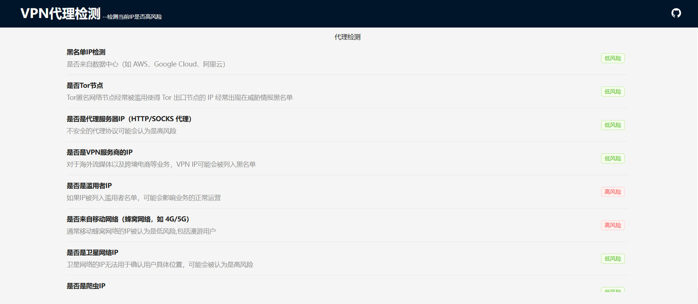

# Detect whether it is a proxy

> 前端增长工程 --网络代理检测,用于检查当前网络是否是代理,是否是高风险,提高跨境电商业务的持续增长

## 技术栈

前端:`React`+`Scss`+`TypeScript`

## 使用截图

## PR与Issues

有使用上的任何问题,欢迎issues,或者直接发起PR

## 鸣谢

感谢后端服务的提供者[incolumitas](https://incolumitas.com/)

